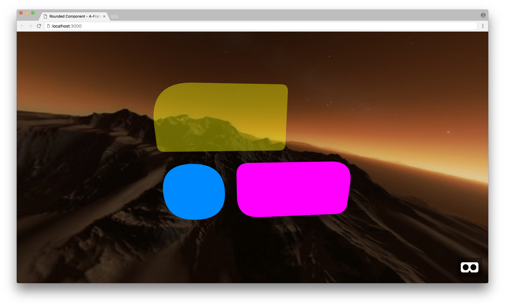

# A-Frame Rounded Primitive/Component

Rounded Primitive/Component for [A-Frame](https://aframe.io) to get a rectangle with rounded edges.
This is great if you need to get smooth edges in your VR UIs.

Note: If you need more control you can check https://github.com/fernandojsg/aframe-slice9-component but the corners will be pixelated (that is why I wanted to use another method to create smooth edges).

## Demo



#### [Live demo](https://etiennepinchon.github.io/aframe-rounded/)

## Getting Started

```html
<a-rounded position="0 1.2 -5" width="4" height="3.1" radius="0.05"></a-rounded>
```

### Attributes

| Name | Description | Type | Default |
| --- | --- | --- | --- |
| width | Width of the container | number | 1 |
| height | Height of the container | number | 1 |
| radius | Border radius of the container | number | 0.3 |
| top-left-radius | Border radius of the container | number | -1 (inherit) |
| top-right-radius | Border radius of the container | number | -1 (inherit) |
| bottom-left-radius | Border radius of the container | number | -1 (inherit) |
| bottom-right-radius | Border radius of the container | number | -1 (inherit) |
| color | Color of the container. | color | "#F0F0F0" |
| opacity | Opacity of the container | opacity | 1 |


## Want to make some changes to it?

### Installation

First make sure you have Node installed.

On Mac OS X, it's recommended to use [Homebrew](http://brew.sh/) to install Node + [npm](https://www.npmjs.com):

    brew install node

To install the Node dependencies:

    npm install


### Local Development

To serve the site from a simple Node development server:

    npm start

Then launch the site from your favourite browser:

[__http://localhost:3000/__](http://localhost:3000/)

If you wish to serve the site from a different port:

    PORT=8000 npm start


## Acknowledgement

file:///Users/etienne/Downloads/three.js-master/examples/webgl_geometry_shapes.html

## License

Distributed under an [MIT License](LICENSE).
